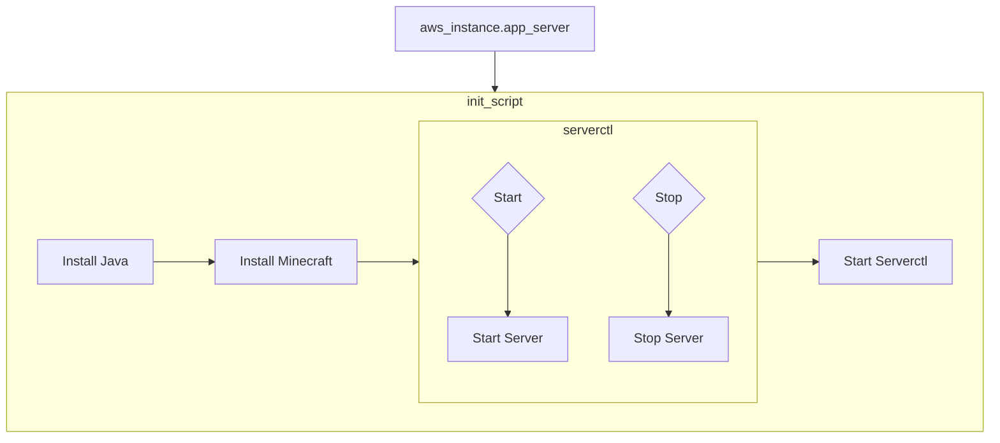
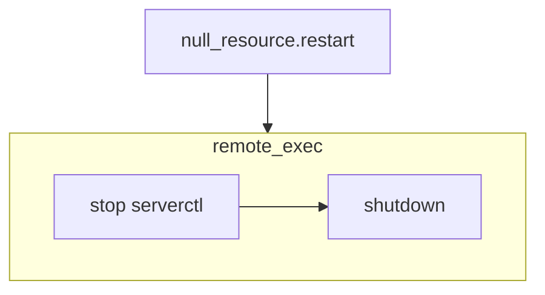

# Minecraft 1.19.4 on AWS with Terraform

---

## Background
This repository contains Terraform scripts to spin up a Minecraft server on EC2 that can be connected with and played on.

## Prereqs
* [Terraform CLI](https://developer.hashicorp.com/terraform/tutorials/aws-get-started/install-cli)
* [AWS CLI](https://docs.aws.amazon.com/cli/latest/userguide/getting-started-install.html)
* [AWS Account](https://aws.amazon.com/free/?all-free-tier.sort-by=item.additionalFields.SortRank&all-free-tier.sort-order=asc&awsf.Free%20Tier%20Types=*all&awsf.Free%20Tier%20Categories=*all) and [associated credentials](https://docs.aws.amazon.com/cli/latest/userguide/getting-started-install.html)

## Setup
1. Clone this repository
2. In the repository run `ssh-keygen`
    * Set the name to `ssh-key.pem`
3. Run `terraform init`

## Usage

### Creating the Server
1. Run `terraform apply`
2. Mark down the `public-ip` and `public-dns`, which are output to console
3. The Minecraft server will start automatically, but it will take several minutes
    * You may check it's progress by ssh-ing into the server with `ssh -i "ssh-key.pem" ec2-user@[public-dns]`

### Joining the Server
1. Start up Minecraft 1.19.4
2. Click on *Multiplayer*
3. Click *Add Server*
4. Input the `public-ip`
5. Click the server icon

### Rebooting the Server
1. Run `terraform apply -target null_resource.restart`
2. The Minecraft server will restart automatically, but will take several minutes

### Destroying the Server
1. Run `terraform destroy`
2. This will also permanently destroy the server world file

## Pipeline

